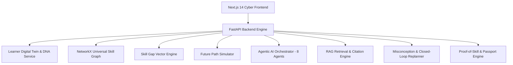

# LEARNOS X: System Architecture & Monorepo Design

## Tech Stack
- **Frontend**: Next.js 14 (App Router) + React + Tailwind/Vanilla CSS + Lucide Icons + Recharts / Canvas.
- **Backend**: FastAPI + NetworkX + SQLAlchemy + SQLite / PostgreSQL + Pytest.
- **Orchestration**: Hybrid Dual Execution (Structured LLM + Deterministic Rule Fallbacks).
